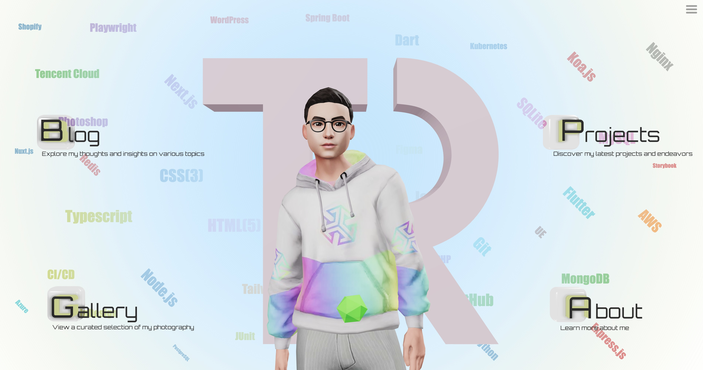

<h1 align="center">3D Portfolio</h3>
<p align="center">A 3D portfolio page built with Next.js, React Three Fiber, and Three.js.</p>
<p align="center">
  <image src="https://img.shields.io/badge/dynamic/json?label=Version&query=version&url=https%3A%2F%2Fraw.githubusercontent.com%2FRoger-twan%2Flab%2Fmain%2Fpackage.json&color=cyan">
  <image src="https://img.shields.io/badge/dynamic/json?label=NODE&query=engines.node&url=https%3A%2F%2Fraw.githubusercontent.com%2FRoger-twan%2Flab%2Fmain%2Fpackage.json&color=purple">
  <image src="https://img.shields.io/badge/dynamic/json?label=NPM&query=engines.npm&url=https%3A%2F%2Fraw.githubusercontent.com%2FRoger-twan%2Flab%2Fmain%2Fpackage.json&color=purple">
  <image src="https://img.shields.io/badge/dynamic/json?label=Next&query=dependencies.next&url=https%3A%2F%2Fraw.githubusercontent.com%2FRoger-twan%2Flab%2Fmain%2Fpackage.json">
  <image src="https://img.shields.io/badge/dynamic/json?label=Tailwind&query=devDependencies.tailwindcss&url=https%3A%2F%2Fraw.githubusercontent.com%2FRoger-twan%2Flab%2Fmain%2Fpackage.json">
  <image src="https://img.shields.io/badge/dynamic/json?label=Three&query=dependencies.three&url=https%3A%2F%2Fraw.githubusercontent.com%2FRoger-twan%2Flab%2Fmain%2Fpackage.json">
</p>
<hr>

## 📸 Screenshot



## ⚒️ Development

```bash
# install dependencies
npm install

# run server
npm run dev
```

Open [http://localhost:3000](http://localhost:3000) in the browser to view the result.

## 📑 GitHub Pages & Actions

Integrated with GitHub Actions, GitHub Pages will automatically deploy whenever there is a push to the main branch.
